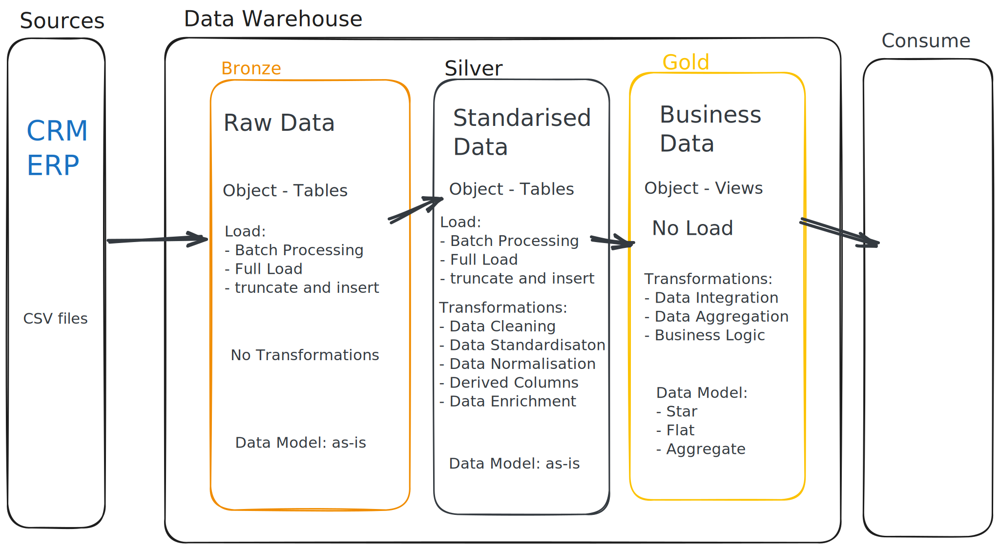

# SQL WareHouse

TODOS:

- [x] init Database

- [x] build Bronze Layer
  - [x] Analyse Source systems
  - [x] code data ingestion
  - [x] validate data -> completeness and schema checks

- [ ] Build Silver Layer
  - [ ] Explore Data
  - [ ] code data cleansing
  - [ ] validation -> correctness checks

- [ ] Build Gold Layer
  - [ ] explore Business Objects
  - [ ] code data integration
  - [ ] validation -> data integration checks
